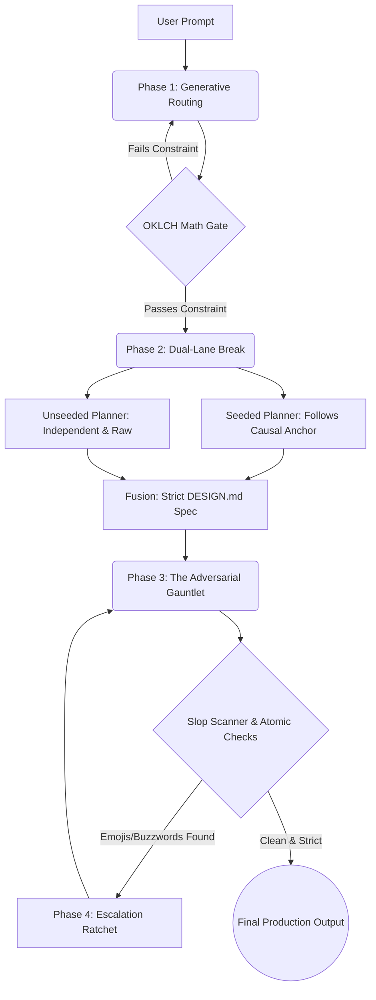

# akash-design-engineering

**The Apex Meta-Skill for Autonomous UI/UX Orchestration**

*A digital monument rooted in ancient soil, favoring tactile stillness over digital noise.*

---

## 🛑 The Problem: The "Slop" Convergence

Standard autonomous coding agents ("vibecoders") default to generic, homogenous, and predictable frontends. Left to their own devices, Large Language Models suffer from **aesthetic convergence**. They output "slop":
- Relying on the exact same blue/purple hex codes.
- Overusing generic bouncing `scale(0)` animations and `ease-in` curves.
- Polluting the UI with text emojis (🚀, ✨, 🔥).
- Spamming AI marketing buzzwords ("Elevate your workflow", "Seamless integration").

**`akash-design-engineering` is the antidote.** 

Built by Akash Priyadarshi, this is an advanced 4-phase orchestration pipeline that physically bars LLMs from hallucinating generic UI. It extracts user intent and forces the AI through a brutal gauntlet of mathematical constraints, OKLCH color routing, and adversarial subagent reviews. The result is bespoke, structurally perfect, production-ready interfaces rooted in **Avant-Garde Editorial Brutalism**.

---

## ⚙️ The 4-Phase Architecture

### Phase 1: Generative Context Routing
Agents do not guess the aesthetic. The pipeline instantiates a stateful `ledger.md` and maps the domain to a rigid **Layout Archetype** (e.g., Spatial Brutalism, Bento, Editorial) and a **Pigment Family**. 
* **The Math Gate:** The system mathematically shifts hues by ±20° in the OKLCH color space. It outright fails and rejects standard generic blues and oranges, forcing unique, high-end color substrates.

### Phase 2: Dual-Lane Bias Breaking
The system dispatches two independent design planners to eliminate LLM path-dependence:
1. **Seeded Lane:** Follows the strict Causal Anchor defined in Phase 1.
2. **Unseeded Lane:** Operates completely raw and independent.
The orchestrator fuses them to catch over-engineering, outputting a rigid `DESIGN.md` spec. The Engineering Swarm then executes this spec with an **empty, decoupled context window** to prevent hallucination.

### Phase 3: The Adversarial Gauntlet
Before code is committed, it passes through the Slop Scanner and the Source-Blind Box.
* **Anti-Slop Engine:** If the scanner detects a single emoji or a single marketing buzzword ("seamless", "elevate"), it instantly FAILS the build.
* **Atomic CSS/DOM Scans:** Validates strict constraints (e.g., `h-dvh`, no `scale(0)`).

### Phase 4: Model Escalation Ratchet
If cheap subagents fail the gauntlet three times, the system automatically hot-swaps to the `pro` tier model to brute-force a resolution, guaranteeing output without human intervention.

---

## 📐 The Atomic Constraints

This pipeline enforces physical frontend laws extracted from the top 267 UI engineering skills on the machine.

### 1. Layout & Geometry
* **Nested Radii Math:** Components MUST obey exact radii math (`outer_radius - padding = inner_radius`).
* **Macro-Whitespace:** Sections must use cinematic spacing (e.g., `py-32 md:py-48`). No cramped DOM structures.
* **Viewport & Typography:** Enforced use of `h-dvh` (never `h-screen`), `text-balance` for headings, `text-pretty` for body, and `tabular-nums` for data.
* **Dashboard Hardening:** Generic card containers are BANNED. Data must be grouped logically via negative space, `border-t`, or `divide-y`.

### 2. DOM & ARIA Engine
* **Performance:** NEVER drive a child's transform from a CSS variable on the parent (prevents layout thrashing).
* **Strict ARIA Gates:** Icon-only buttons MUST have `aria-label`. Errors MUST use `aria-describedby` and `aria-invalid="true"`. Loading states MUST use `aria-busy="true"`.
* **Semantic Rigidity:** The agent is forced to use strict semantic tags (`<data>`, `<samp>`, `<kbd>`, `<output>`) instead of nested `
` soup.

### 3. Motion Physics & Visuals
* **Kinetics:** Interaction feedback is hard-capped at `< 200ms`. Looping animations MUST pause off-screen. Bouncing chevron "Scroll to explore" cues are BANNED.
* **Fake Assets Banned:** NEVER build fake product UIs out of `
` rectangles. Must use real images with sophisticated CSS filters (`grayscale`, `mix-blend-luminosity`).
* **Iconography:** NEVER hand-roll SVG icon paths. Must use high-quality libraries (Phosphor Light, Radix) with a strict global `strokeWidth` of `1.5`. 

---

## 🚀 Usage & Deployment

*This is an autonomous orchestration script designed for Advanced Agentic Coding environments.*

Provide the tool with a domain (e.g., *"Build a brutalist marketing site for an architecture firm"*). The orchestrator handles the ledger instantiation, context routing, color math, and adversarial validation automatically.

---

## 🛡️ Security & Zero-Tolerance Policy

This tool runs **locally**. It does not phone home, it does not telemetry-track, and it does not harvest your project context to third-party databases. It leverages local subagent capabilities strictly within your defined workspace.

**Slop Policy:** Any PRs or modifications to the `design-engineer-cookbook` that introduce generic AI tropes, emojis, or attempt to bypass the OKLCH Math Gate will be instantly rejected.

---

## 👤 Author

**Akash Priyadarshi**  
A self-taught developer and AI-augmented systems engineer from Patna, Bihar, India.  
*“I use AI as a force multiplier, but never surrender taste, geometry, or mathematical precision to it. We build systems that crush slop.”*

   
  
   
  <i>Built with absolute mathematical precision.</i>

---
*SEO Keywords: AI Coding Agent, UI/UX Design Engineering, Autonomous Software Generation, Subagent Driven Development, OKLCH Color Routing, Generative Design System, Akash Priyadarshi, Frontend Architecture, Anti-Slop AI, FOSS, Brutalist Web Design.*
